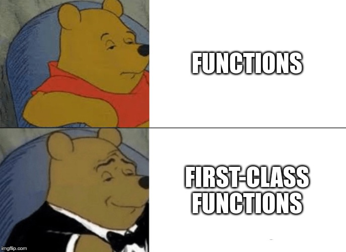
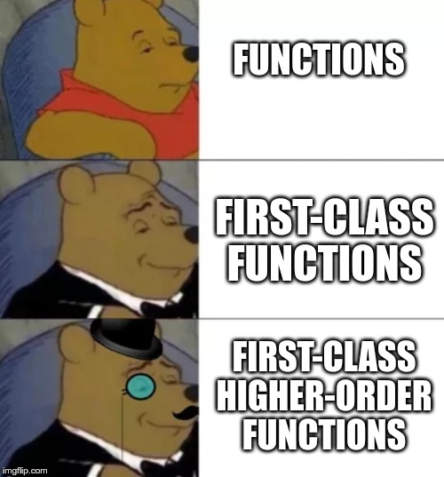
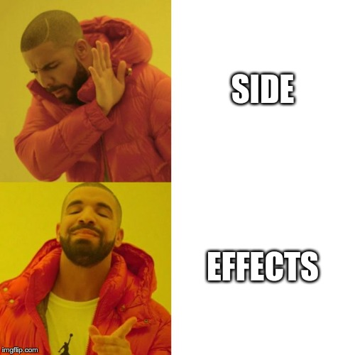
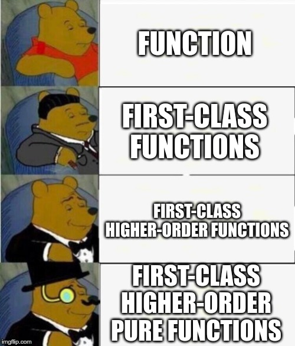
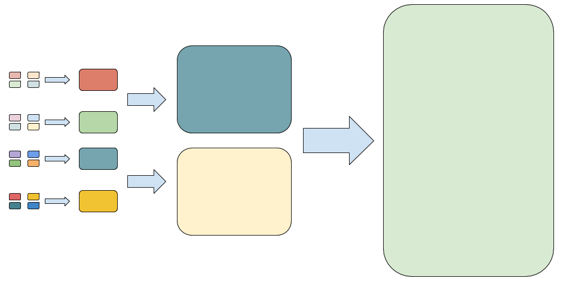

import {Notes, Appear, Image} from 'mdx-deck'
import {Split, FullScreenCode} from 'mdx-deck/layouts'
import highlight from '@mdx-deck/themes/syntax-highlighter-prism'

import Repl from './repl'
import Reference from './Reference'
import WithBackground from './WithBackground'
import theme from './theme'

export const themes = [theme, highlight]

<Image src="./images/first-slide.png" />

---

<Image src ="./images/map-and-compass-people.jpeg" />

---

## For the people?

---

A **monad** in X is just a **monoid**

in the category of **endofunctors** of X.

<Reference
  author="Saunders Mac Lane"
  href="https://www.springer.com/gp/book/9780387984032"
  reference="Categories for the Working Mathematician"
/>

---

<Image src="./images/what.gif" />

---

<Image src="./images/come-on.gif" />

---

<Image src="./images/cross-road-sign.jpeg" />

---


---

## What does it mean

## to write functional code?

---

<Image src="./images/cool.jpg" />

---

<Image src="./images/goal.jpeg" />

---

code terse, yet easy to reason about

<Reference
  href="https://github.com/MostlyAdequate/mostly-adequate-guide"
  reference="Professor Frisby's Mostly Adequate Guide to Functional Programming"
  author="Brian Lonsdorf"
/>

---

don't reinvent the wheel

<Reference
  href="https://github.com/MostlyAdequate/mostly-adequate-guide"
  reference="Professor Frisby's Mostly Adequate Guide to Functional Programming"
  author="Brian Lonsdorf"
/>

---

represent problems in terms of generic, composable bits

<Reference
  href="https://github.com/MostlyAdequate/mostly-adequate-guide"
  reference="Professor Frisby's Mostly Adequate Guide to Functional Programming"
  author="Brian Lonsdorf"
/>

---


---


---

## First class citizens

<Appear>

functions are values

</Appear>

---

```js
function add(a, b) {
  return a + b
}

const sum = (x, y) => add(x, y)

sum(1, 2) // 3
```

<Appear>

<div>

```js
const sum = add

sum(1, 2) // 3
```

</div>

</Appear>

---

```js
[1, 2, 3].reduce((acc, i) => add(acc, i), 0)
```

<Appear>

<div>

```js
[1, 2, 3].reduce(add, 0)
```

</div>

</Appear>

---



---

## Higher-Order Functions

---

```js
[1, 2, 3].reduce(add, 0)
```

---

```js
const mult = (a) => (b) => a * b
const by2 = mult(2)

typeof by2 // 'function'
by2(2)     // 4
mult(2)(2) // 4
```

---



---

<WithBackground src="./images/pure.jpeg" color="#2d2d2d">

## Pure functions

</WithBackground>

---

### same input -> same output

<Reference
  href="https://github.com/MostlyAdequate/mostly-adequate-guide"
  reference="Professor Frisby's Mostly Adequate Guide to Functional Programming"
  author="Brian Lonsdorf"
/>

---


<Appear>

<div>

```js
Math.random() // 0.0814034364872233
Math.random() // 0.6760995607735527
```

</div>

</Appear>

<Reference href="https://xkcd.com/221/" reference="xkcd" />

---

```js
Date.now() // 1560981656763
Date.now() // 1562927443676
```

---

### no observable side effect

<Reference
  href="https://github.com/MostlyAdequate/mostly-adequate-guide"
  reference="Professor Frisby's Mostly Adequate Guide to Functional Programming"
  author="Brian Lonsdorf"
/>

---

<Image src="./images/wallet.jpeg" />

---

### splice vs. slice

---

<Image src="./images/gorilla-thinking.jpg" />

---

<Repl snippet="splice" persist />

---

<Repl snippet="slice" persist />

---

## Predictability

---

<WithBackground src="./images/factory-wroker-saw.jpeg" color="white">

## What about I/O ?!

</WithBackground>

---



---

## pure functions === easy tests

---

## same input -> same output

---

## no observable side effects

---

```js
const saveUser =             (user) => Db.save(user)
```

<Appear>

<div>

```js
const makeSaveUser = (Db) => (user) => Db.save(user)
```

</div>

<div>

```js
const makeSaveUser = (Db) => Db.save
```

</div>

</Appear>

---

```js
const makeSaveUser = (Db) => Db.save

const db = connect(config)

const saveUserToDB = makeSaveUser(db) // pure

saveUserToDB(user) // impure
```

---

```js
// makeSaveUser :: Db -> User -> Promise User
const saveUser = (Db) => Db.save

// production
const db = connect(config)
const saveUserToDB = makeSaveUser(db)

// testing
const mockDB = createTestDB({users: []})
const saveUserTest = makeSaveUser(mockDB)
```

---

Cache

Parallel

Portable

Self-documenting

---

<Appear>

### React

</Appear>

`f(data) -> view`

<Reference
  author="Guillermo Rauch"
  reference="Pure UI"
  href="https://rauchg.com/2015/pure-ui"
/>

---

<Appear>

### Redux

</Appear>

`f(state, action) -> state`

<Reference
  author="Dan Abramov"
  reference="Live React: Hot Reloading with Time Travel"
  href="https://www.youtube.com/watch?v=xsSnOQynTHs"
/>

---



---

<Repl snippet="curryWanted" persist />

---

<WithBackground src="./images/curry.jpeg" color="white">

## Currying & Partial Application

</WithBackground>

<Notes>
<b>Currying</b>: is the technique of translating the evaluation of a function
that takes multiple arguments into evaluating a sequence of functions, each with
a single argument.

<b>Partial Application</b>: the process of fixing a number of arguments to a
function, producing another function of smaller arity.

<b>Arity</b>: number of parameters a function accepts.

</Notes>

---

<Repl snippet="curry1" persist />

---

<WithBackground src="./images/wall-stones.jpeg" color="black">

<Appear>

<h2 style={{ margin: 0, marginBottom: -20 }}>Composition</h2>

</Appear>

<h3 style={{ margin: 0, marginTop: -20 }}>(f ∘ g)(x) = f(g(x))</h3>

</WithBackground>

---

<Repl snippet="compose" persist withCurry />

---

<Repl snippet="compose3" persist withCurry />

---

<Repl snippet="composeN" persist withCurry />

---

## Composition is fractal



`operation -> service -> use case -> app`

<Reference
  href="https://fsharpforfunandprofit.com/fppatterns/"
  reference="Functional Programming Design Patterns"
  author="Scott Wlaschin"
/>

---

<WithBackground src="./images/compass-and-forest.jpeg" color="white">

<div>

<h2 style={{ marginBottom: 0 }}>What does it mean</h2>

<h2 style={{ marginTop: 0 }}>to write functional code?</h2>

</div>

</WithBackground>

---

<Image src="./images/never-stop-exploring.jpeg" />

---


---


---

### References

<small>

- [Professor Frisby's Mostly Adequate Guide to Functional Programming](https://github.com/MostlyAdequate/mostly-adequate-guide) <small>([Brian Lonsdorf](https://twitter.com/drboolean))</small>
- [Functional Programming Design Patterns](https://fsharpforfunandprofit.com/fppatterns/) <small>([Scott Wlaschin](https://twitter.com/ScottWlaschin))</small>
- [Pure UI](https://rauchg.com/2015/pure-ui) <small>([Guillermo Rauch](https://twitter.com/rauchg))</small>
- [Hot Reloading with Time Travel](https://www.youtube.com/watch?v=xsSnOQynTHs) <small>([Dan Abramov](https://twitter.com/dan_abramov))</small>

</small>

---

# Thλnks!
